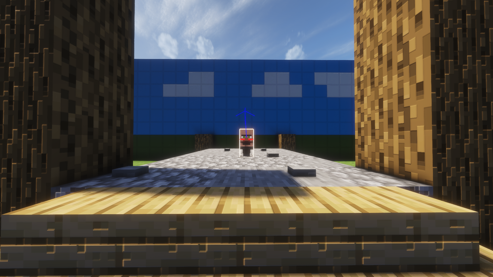
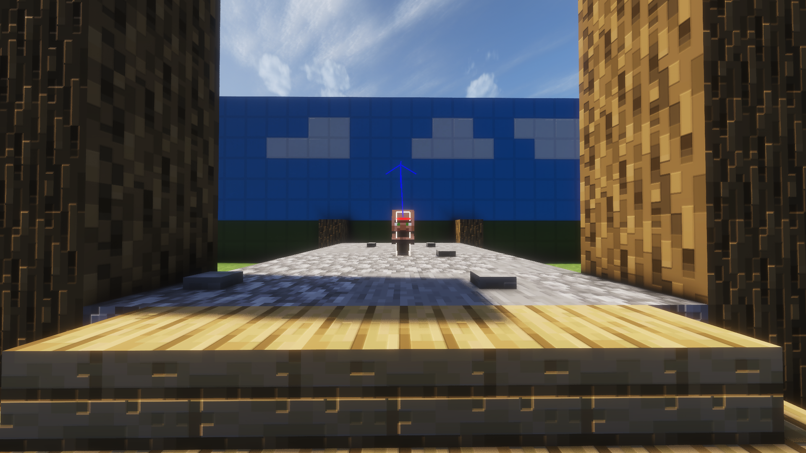
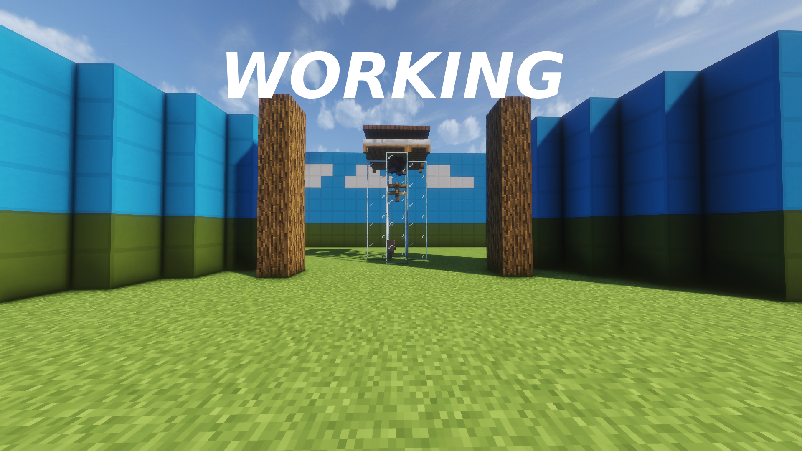

Restores the new baby villager hitbox (26.1+) behavior with a pre-26.1 version, fixing broken farms and breeders affected by recent changes. As well as a toggle for the old baby villager model.

### Commands:
- ```/classicvillagers set``` - Enable / Disable
- ```/classicvillagers model``` - New / Old
- ```/classicvillagers reload``` - Reload villagers

### Config:
You can configure Classic Villagers using a couple of methods:
- [Mod Menu](https://modrinth.com/mod/modmenu)
- Commands (OP only)
- ```.config\classicvillagers.json```

### Project Links:
[Github: pohci](https://github.com/pohci/classicvillagers)

[Modrinth: pohci](https://modrinth.com/mod/classic-villagers)

[Curseforge: pohci](https://curseforge.com/minecraft/mc-mods/classic-villagers)

## Gallery

## Before:

## After:

## Farms Fixed!

